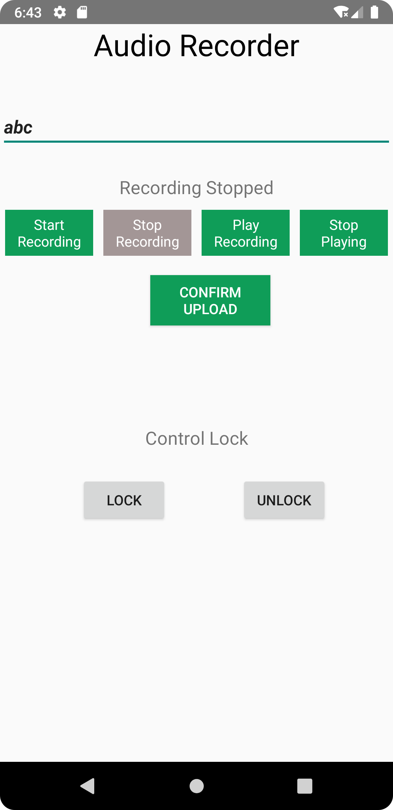

# VoLo Voiceprint Recognition Smart Lock

VoLo is a voiceprint recognition smart lock designed  for Airbnbs. It provides a secure and convenient way for hosts and guests to access properties without the need for traditional keys or PIN codes.

## Use Case Scenario

Imagine you're an Airbnb host and you want to streamline the check-in process for your guests. With VoLo, your guests can simply use their voice to unlock the door. Before their arrival, they can pre-record their voiceprints using the VoLo mobile application. These voiceprints are securely stored on the server for later comparison.

The lock comes essential in Airbnbs, where there is no guarantee that a host will change passcode everytime a new guest arrives. With VoLo, guest are using their own voice to open the lock, and with a transparent management system through view access to the server storage, guests can be more assured with no anxiety that the previous guest will enter the property.

When a guest arrives at the property, they approach the VoLo smart lock. The lock is equipped with a gesture sensor and a microphone sensor. When guest comes near to the entrance and wave towards the lock, the gesture sensor will be triggered for the guest to speaks a passphrase.

## Hardware Requirements

To build and use the VoLo system, you will need the following hardware components:

- [ESP32 microcontroller](https://www.espressif.com/en/products/socs/esp32)
- INMP441 Microphone sensor 
- ADPS 9960 Gesture sensor
- Solenoid Lock
- 9V battery and a stepup regulator
- LED

## Main Component Parts

VoLo consists of three main component parts:

1. **Physical Lock**: The physical lock mechanism is the core component of VoLo. It integrates a microphone sensor, a gesture sensor, and an ESP32 microcontroller. The microphone sensor captures the guest's voice, while the gesture sensor triggers the voice recording process. 

2. **Mobile Application**: The VoLo mobile application allows users to pre-record their voices before arriving at the property, listen to it and upload to server. Guests can choose to open the lock from the app also, if that's more convenient. The mobile app communicates with the server to store and retrieve voiceprints for authentication.

3. **ESP32 Server**: The ESP32 server acts as a server to provide recorded .wav files to the cloud server, as well as a api for mobile app to control the lock.

3. **Cloud Server**: The server serves as the central storage and processing unit for voiceprints. It securely stores the pre-recorded voiceprints received from the mobile app. When a guest attempts to unlock the door, the server performs voiceprint matching against the stored voiceprints. It calculates a match score and sends it back to the ESP32 microcontroller for decision-making.

## Software Architecture and Code Structure

The VoLo system follows a client-server architecture. The mobile application is built using **java** on **Android framework** and communicates with the server via http requests. The server is built with python, handles incoming requests, stores voiceprints, and performs voiceprint matching. The ESP32 microcontroller firmware, manages communication with the microphone sensor, gesture sensor, and server.

```
VoLock File Structure
├── README.md
├── assets
├── esp
├── code_assets
├── final_code
└── Androidrecorder

1. **assets**: Contains the voiceprint in .wav file named as their nicknames. 

2. **esp**: Holds the .wav file uploaded from the physical microphone, for match score calculation. Is overwritten each time user activates the microphone and voice is recorded.

3. code_assets: Includes individual codes of each functionalities. 

4. **final_code**: Includes the final_code for running ESP32.

4. **Androidrecorder**: Includes the codes for the Android Mobile App.


Feel free to copy and adjust the directory structure based on your project's needs and add any additional directories as required.

```

## Architecture Diagram


The architecture diagram above illustrates each components and their interactions within the VoLo system. It showcases how the mobile app, server, and ESP32 microcontroller as well as solenoid lock, gesture sensor, microphone sensor and stepup circuits collaborate to enable voiceprint recognition and control the lock mechanism.


## Mobile App Screenshot



## Installation and Usage

To install and use VoLo, follow the steps below:

Clone the project repository: `git clone https://github.com/your-username/volo.git`
